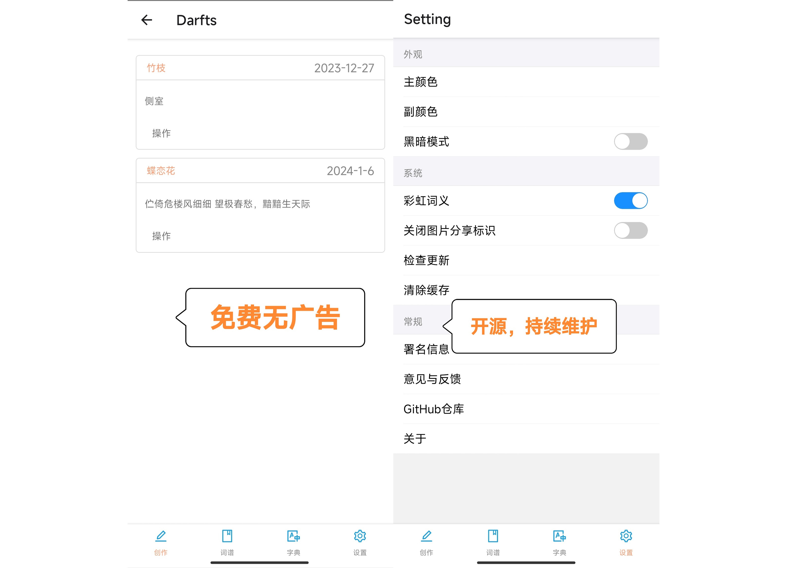

# fill poem 奉旨填词

一款填词app，基于React Native开发的移动端app，选择词牌名并让这款APP帮助你开始创作

## 下载

[通过github release下载](https://github.com/charlesix59/fill_poem/releases)

[通过百度云盘下载](https://pan.baidu.com/s/18kJGedL4la8FpQW1myi0ig?pwd=vine) 提取码：vine

除此之外我还在寻找其他简单快速（~~并且免费~~）的下载服务

## 为什么选择奉纸填词

我们有一个功能非常强大的网站：搜韵！

但是这个网站对移动端的适配并不算太友好，因此我做出了这个app并且加入了一些独特的功能。

以下是该app的优势：

- **易用**：您可以非常轻松的上手本应用并使用它辅助您的创作
- **强大**：拥有特色的填词方式以及相当完备的功能
- **干净**：没有广告的困扰，页面干净不混乱
- **美观**：简约与直观的形状搭配合适的色彩
- **安全**：您的数据全部保存在本地，不用担心有人会剽窃您的内容
- **开源**：该APP以MIT LICENSE在Github开源
- **免费**：免费是理所应当的
- **持续维护**：该APP持续更新功能，修改bug
- **可自定义**：拥有丰富的自定义功能，打造适合你的app

## 如何使用

1. 将下载好的APK安装到手机

### 我写好了词想进行韵律的检查

- 您可以在创作标签页点击韵律检查按钮
- 输入您创作的词牌名（请您自行保证输入的词牌名与词谱中的词牌名一致）
- 输入您创作的作品内容，作品内容请用【，】或【。】隔开
- 点击检查，您将会看到匹配情况

### 我想对照词谱进行填词

- 您可以在词谱界面选择自己希望填写的词谱，然后在随后的界面中选择相应的词格
- 点击对应的词格将进入填词界面
- 每个输入框<mark>可以并且仅可以</mark>输入<mark>一个汉字</mark>
- 您将可以直观的看到输入的汉字是否与输入框上部的平仄相符，若相符则输入框为绿色，否则为红色。若系统不能确定，则为蓝色，需要您手动确认
- 您输入的第一个韵字将会作为整首词的韵律（已知问题：变韵词，如菩萨蛮，将会被错误识别）
- 如果您已经填词结束或者希望暂存内容，可以点击下方的<mark>保存草稿</mark>按钮，然后您将可以在创作界面的草稿箱中找到对应的草稿
- 您可以在草稿箱中点击【操作-编辑】继续您的编辑并进行暂存
- 您可以在草稿箱中点击【操作-预览】来预览您的作品，在此界面可以将您的作品复制或者保存为图片

### 我想在填词的时候查找字典

- 您可以在填词时随意切换到字典标签，这并不会导致您正在进行的动作被覆盖
- 选择平水韵或者词林正韵，并在其中选择或搜索自己需要的内容

### 设置中的选项都有什么作用

## 贡献

### 反馈与意见

您的反馈是一种非常重要的贡献！

在您反馈时您最好在此Github仓库页面创建issue，并详细阐述您的问题，这样会方便我定位与解决问题。

除此之外您也可以通过软件内的【意见与反馈】功能来联系我，或者直接发送邮件到我的邮箱`CharlesMin2001@outlook.com`

### PR

非常欢迎大家修改我的代码，并提交Pull Request，我会尽快审核并通过您的代码。

具体开发有关的内容可以查看下面的【开发指南】条目

### 我需要帮助！

如果你觉得这个项目还不错，希望能够参与其中并且您拥有以下的技能之一，那么我非常希望您能与我联系！（联系方式见上文）

技能树：

- IOS开发（如果您拥有苹果的开发环境或苹果开发者账号就更好了🫶）
- 前端开发（React Native）
- 平面设计（救救孩子的图标吧！ T^T）
- UI设计（呜呜）
- 古文顾问（在文字释义、诗词韵律等方面给孩子一点帮助）

## 开发指南

> 确保你拥有RN的开发环境

> PS：欢迎你把项目用到期末项目之类的地方（或许……只要不在课堂之外的地方分发无LICIENSE副本都是允许的……）

### 安装依赖

`npm install`

### 运行

运行**Metro**：

`npm run start`

启动应用(安卓)：

`npm run android`

启动应用(ios):

`npm run ios`

### ⚠️：此项目依赖均未加入IOS pod

本项目依赖的部分库如下：

- ant-design/react-native
- react-native-camera-roll
- react-native-clipboard
- react-navigation/bottom-tabs
- react-navigation
- realm

部分库需要下载native文件，如果上述依赖出现问题还请您检查依赖是否正确下载、安装与链接
